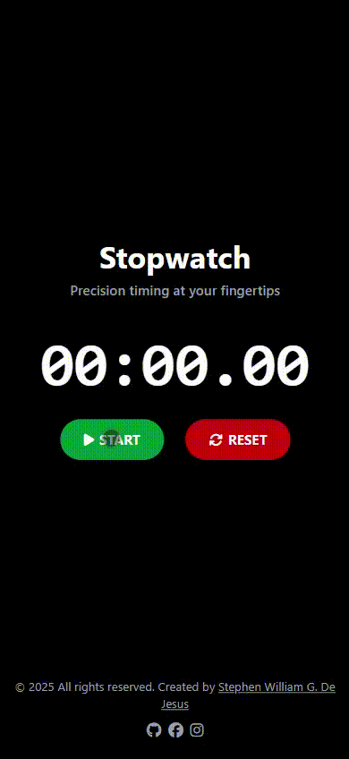
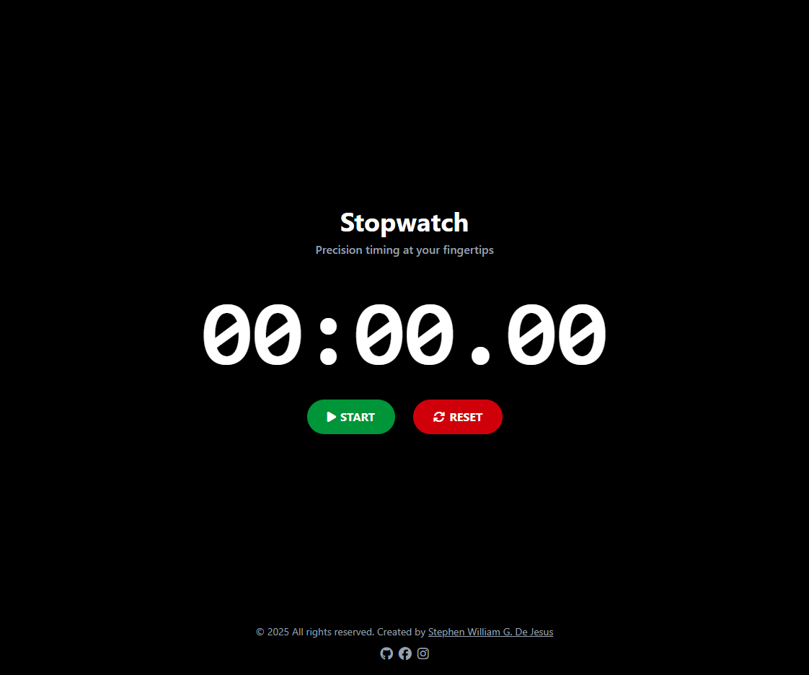

# ⏱️ Stopwatch Web App – Precision Timing Tool

A sleek and highly accurate stopwatch application built with **HTML5**, **Tailwind CSS**, and **JavaScript**.  
Features precise millisecond timing, lap recording, and a modern dark theme interface with full accessibility support.

Crafted by **[Stephen William G. De Jesus](https://www.facebook.com/stephenwilliam.dejesus.5/)**, this project demonstrates real-time DOM manipulation, interval management, and responsive design principles.

---

## 📸 Preview  

### 🎞️ Live Interaction (GIF)  


### 🖼️ Application Screenshot  


---

## 🌐 Live Demo  
[View Live Demo](https://bogiiiie.github.io/15-javascript-stopwatch/)

---

## ✨ Features

- ⏱️ **Precision Timing** – Accurate to 10 milliseconds with real-time display
- ▶️ **Start/Pause/Reset Controls** – Full stopwatch functionality with intuitive buttons
- 🏃 **Lap Recording** – Record and display multiple lap times with auto-scroll
- 🎨 **Dark Theme UI** – Modern black background with colorful accent buttons
- 📱 **Fully Responsive** – Optimized for desktop, tablet, and mobile devices
- ♿ **Accessibility Ready** – ARIA labels, semantic HTML, and screen reader support
- ⌨️ **Keyboard Navigation** – Full keyboard accessibility for all controls
- 🎯 **Visual Feedback** – Smooth button transitions and hover effects
- 📊 **Live Updates** – Real-time display updates every 10ms for smooth animation
- 🔄 **State Management** – Proper pause/resume functionality with time persistence

---

## 🖥️ How to Use

1. **Start Timing** – Click the green "Start" button to begin the stopwatch
2. **Pause/Resume** – Use the orange "Pause" button to stop timing (resume with "Start")
3. **Record Laps** – Click the blue "Lap" button while timing to record lap times
4. **Reset Timer** – Use the red "Reset" button to clear all timing and lap data
5. **View Laps** – Scroll through recorded lap times in the dedicated lap section

---

## ⏰ Timing Display Format

```
MM:SS.MS
Minutes : Seconds . Milliseconds (10ms precision)
```

**Example:** `02:35.47` = 2 minutes, 35 seconds, 470 milliseconds

---

## 🛠️ Built With

- [HTML5](https://developer.mozilla.org/en-US/docs/Web/Guide/HTML/HTML5) – Semantic structure with ARIA roles
- [Tailwind CSS](https://tailwindcss.com/) – Utility-first styling and responsive design
- [JavaScript ES6+](https://developer.mozilla.org/en-US/docs/Web/JavaScript) – Timing logic and DOM manipulation
- [Font Awesome 6.5.2](https://fontawesome.com/) – Professional iconography
- [Date API](https://developer.mozilla.org/en-US/docs/Web/JavaScript/Reference/Global_Objects/Date) – High-precision timing calculations

---

## 📁 Project Structure

```
15-javascript-stopwatch/
├── index.html          # Main HTML structure
├── script.js           # JavaScript timing logic
├── output.css          # Tailwind CSS compiled styles
└── images/
    ├── demo.gif        # Live interaction demo
    └── demo.png        # Application screenshot
```

---

## 🚀 Getting Started

To run this project locally:

```bash
git clone https://github.com/bogiiiie/15-javascript-stopwatch.git
cd 15-javascript-stopwatch
open index.html
```

No build process required — just open `index.html` in your browser!

---

## 🎯 Core Functions

### Timing Functions
- `startStopWatch()` – Initiates timing with high-precision Date.now()
- `pauseStopwatch()` – Pauses timer and preserves elapsed time
- `resetStopWatch()` – Resets all timing data and UI state
- `formatTimeUnit(unit)` – Formats single digits to two-digit display

### UI Management
- **Button State Switching** – Dynamic show/hide of control buttons
- **Lap Recording** – Creates and displays lap time entries
- **Auto-scroll** – Automatically scrolls to newest lap times
- **Real-time Updates** – 10ms interval updates for smooth display

### State Variables
```javascript
let startTime;              // Timing reference point
let elapsedBeforePause;     // Accumulated time before pause
let intervalId;             // setInterval reference for cleanup
let currentTime;            // Formatted time string for laps
let laps;                   // Lap counter
```

---

## ♿ Accessibility Features

- 🏷️ **ARIA Labels** – Descriptive labels for all interactive elements
- 📢 **Live Regions** – Screen reader announcements for time updates
- ⌨️ **Keyboard Navigation** – Full tab-through functionality
- 🎯 **Focus Management** – Clear focus indicators on all buttons
- 📱 **Touch Friendly** – Large button targets for mobile devices
- 🔊 **Semantic HTML** – Proper heading hierarchy and landmarks
- 🎨 **High Contrast** – Sufficient color contrast for readability

---

## 📱 Responsive Breakpoints

- **Mobile (< 640px)** – Stacked layout with large touch targets
- **Tablet (640px - 1024px)** – Balanced spacing and readable text sizes
- **Desktop (> 1024px)** – Centered layout with optimal viewing distance

### Typography Scaling
- **Mobile:** 7xl (112px) time display
- **Small:** 8xl (128px) time display  
- **Medium+:** 9xl (144px) time display

---

## 🎨 Design System

### Color Palette
- **Background:** `bg-black` – Pure black for focus
- **Text Primary:** `text-white` – High contrast white
- **Text Secondary:** `text-gray-400` – Subtle gray for descriptions
- **Success:** `bg-green-600/90` – Start button
- **Warning:** `bg-orange-600/90` – Pause button  
- **Danger:** `bg-red-600/90` – Reset button
- **Primary:** `bg-blue-600/90` – Lap button

### Button States
- **Hover:** Darker shade with smooth transition
- **Active:** Scale down effect (`active:scale-95`)
- **Focus:** Visible focus rings for accessibility

---

## ⚡ Performance Features

- **Efficient Updates** – 10ms intervals balance smoothness with performance
- **Memory Management** – Proper interval cleanup on pause/reset
- **DOM Optimization** – Minimal DOM queries with cached references
- **Smooth Animations** – CSS transitions for button interactions
- **Auto-scroll** – Smart scrolling to latest lap times

---

## 🔗 Connect with Me

- 💻 **GitHub:** [@bogiiiie](https://github.com/bogiiiie)
- 📘 **Facebook:** [Stephen William De Jesus](https://www.facebook.com/stephenwilliam.dejesus.5/)
- 📷 **Instagram:** [@stephenwilliamdejesus](https://instagram.com/stephenwilliamdejesus)

---

## 👨‍💻 Author

Created by **Stephen William G. De Jesus**

---

## 📄 License

© 2025 All rights reserved. Created by Stephen William G. De Jesus.

---

## 🚀 Future Enhancements

- 📊 **Split Time Display** – Show split times vs total elapsed time
- 🎵 **Sound Effects** – Audio feedback for button clicks and laps
- 💾 **Session Persistence** – Save timing data across browser sessions
- 🏃‍♂️ **Workout Timer** – Interval training mode with rest periods
- 📈 **Performance Analytics** – Average lap time and performance trends
- 🎨 **Theme Switcher** – Multiple color themes and customization
- ⏰ **Countdown Timer** – Reverse timing functionality
- 📱 **PWA Support** – Install as standalone mobile app
- 🔄 **Export Data** – Export lap times to CSV or share functionality
- 📧 **Email Integration** – Send timing results via email

---

## 🔥 Technical Specifications

| Feature | Implementation |
|---------|----------------|
| **Timing Precision** | 10 millisecond accuracy |
| **Update Frequency** | Every 10ms (100 FPS) |
| **Browser Support** | Modern browsers with ES6+ |
| **Responsive Design** | Mobile-first approach |
| **Accessibility** | WCAG 2.1 AA compliant |
| **Performance** | Optimized DOM manipulation |
| **Memory Usage** | Efficient interval management |
| **File Size** | Lightweight, no external dependencies |

---

## 🧪 Browser Compatibility

- ✅ **Chrome** 90+
- ✅ **Firefox** 88+  
- ✅ **Safari** 14+
- ✅ **Edge** 90+
- ✅ **Mobile browsers** (iOS Safari, Chrome Mobile)

---

## 📋 Testing Checklist

- [ ] Start/pause/reset functionality
- [ ] Lap recording and display
- [ ] Time format accuracy (MM:SS.MS)
- [ ] Responsive design on all devices
- [ ] Keyboard navigation
- [ ] Screen reader compatibility
- [ ] Button state management
- [ ] Auto-scroll in lap section
- [ ] Footer year auto-update
